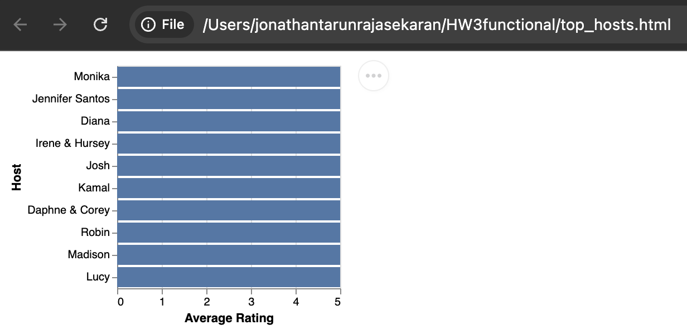

# AirBnB Data Handler - HW3 Functional Programming:

## Author
Jonathan Tarun Rajasekaran

## About
This is an assignment for my class in Programming Design Paradigms at Northeastern University under Professor John Alexis Guerra Gomez. The goal was to create an AirBnBDataHandler to do some functions such as filter, computing stats and ranking hosts by number of listings. The assignment was done with the functional programming paradigm, using only pure and higher order functions.  **P.S: There are a lot of CSVs in the repo since I tried using the export function too many times SORRY!**

## Data
Check out the original dataset [here.](https://data.insideairbnb.com/united-states/ca/oakland/2024-12-22/data/listings.csv.gz)

## Instructions to run

1. Clone the repository
2. Run ```npm install```
3. Run ```node index.js ./listings.csv```
4. Choose any option to view!

## Creative Additions

1. Comparing 2 Filters: I added an option to input 2 filters and allow the users to look at and compare the statistics of the same.

![Compare Two Filters]](c2f.png)

2. I added a small bar chart visualization of the top 10 hosts according to average rating. (However this ended up with a not so useful visualization since all top 10 hosts had an average rating of 5.0).



## YouTube Video
[Link](https://youtu.be/226HiyZR_pY) to the YouTube video showing a demo of this assignment.

## Pure Function

**Example:**
```js
/**
 * Returns the current data.
 * @returns {Array<Object>} The current list of listings.
 */
getData() {
  return data;
}
``` 

This is a pure function because:

- Returns the same output for the same input every time 
- It has no side effects (doesn't modify external state)

**Counter Example:**

```js
/**
 * @returns {Array<Object>} The modified list of listings.
 */
getData() {
  data.forEach(listing => {
    listing.retrievedAt = new Date().toISOString();
    
    // Modifying existing data
    if (listing.price) {
      listing.price = Number(listing.price) * currentExchangeRate; // Using an external variable
    }
  });
  
  console.log(`Data retrieved at ${new Date()}`);
  fs.writeFileSync('last_access.log', new Date().toISOString());
  
  return data;
}
```

Why is this an Impure function:

- The existing data is modified
- Causes side effects (Logging on console, modifying an existing attribute using an external variable)
- Breaks the rule of immutability
- Depends on external state (`currentExchangeRate`)


## Higher order functions

**Example:**

```js
export const AirBnBDataHandler = (data) => {
  return {
    /**
     * Filters listings by given criteria.
     * @param {Object} criteria - Filter criteria (e.g., { price: 150, rooms: 2, reviewScore: 4 }).
     * @returns {Object} A new AirBnBDataHandler instance with filtered data.
     */
    filter(criteria = {}) {
        const filteredData = data.filter((listing) => {
          let valid = true;
          if (criteria.price !== undefined) {
            // Clean the price value from the CSV (e.g. "$160.00" becomes 160.00)
            const cleanPrice = parseFloat(listing.price.replace(/[^0-9.]/g, ''));
            valid = valid && cleanPrice <= criteria.price;
          }
          if (criteria.bedrooms !== undefined) {
            valid = valid && Number(listing.bedrooms) === criteria.bedrooms;
          }
          if (criteria.review_scores_rating !== undefined) {
            valid = valid && Number(listing.review_scores_rating) >= criteria.review_scores_rating;
          }
          return valid;
        });
        return AirBnBDataHandler(filteredData);
      },
```
**The entire AirBnBDataHandler function is a higher order function since it returns multiple functions (filter(), computeStats(),etc)**

Why is it a higher order function:

- Because it returs one or more functions

**Counter Example:**

```js
export const AirBnBDataHandler = (data) => {
  let filteredData = [...data];
  let currentCriteria = {};
  
  console.log(`Loaded ${data.length} listings`);
  
  // Return data directly instead of functions
  return filteredData;
};
```

Why it breaks the principle:

- It does not take any function as input nor does it return a function.

## AI Usage:

- I used AI for all the data processing related to CSVs:

Prompt: *csv file*  this is a dataset of airbnb listings in Oakland, I am doing an assignment which requires me to parse this csv to perform some useful functions such as computing stats, ranking hosts and filtering data. The user needs to access these functions via the command line using readLine, I should also be able to chain these functions (eg: data.filter(...).rank()) Could you show me how the filter function would be written so that I can get a better idea.

Model: ChatGPT - o3 mini

Response:
```js
import { promises as fs } from 'node:fs';
import csvParse from 'csv-parse/lib/sync';

/**
 * Creates an AirBnBDataHandler instance.
 * @param {Array<Object>} data - The list of AirBnB listings.
 * @returns {Object} The handler with chained methods.
 */
export const AirBnBDataHandler = (data) => {
  return {
    /**
     * Filters listings by given criteria.
     * @param {Object} criteria - Filter criteria (e.g., { price: 150, rooms: 2, reviewScore: 4 }).
     * @returns {Object} A new AirBnBDataHandler instance with filtered data.
     */
    filter(criteria = {}) {
      const filteredData = data.filter((listing) => {
        let valid = true;
        if (criteria.price !== undefined) {
          valid = valid && Number(listing.price) <= criteria.price;
        }
        if (criteria.rooms !== undefined) {
          valid = valid && Number(listing.rooms) === criteria.rooms;
        }
        if (criteria.reviewScore !== undefined) {
          valid = valid && Number(listing.review_score) >= criteria.reviewScore;
        }
        return valid;
      });
      return AirBnBDataHandler(filteredData);
    }
  }
}
```

```js
import readline from 'readline';
import { AirBnBDataHandler } from './AirBnBDataHandler.js';
import { promises as fs } from 'node:fs';
import csvParse from 'csv-parse/lib/sync';

/**
 * Initializes the CLI.
 * @param {string} csvFilePath - Path to the CSV data file.
 */
export const startCLI = async (csvFilePath) => {
  try {
    const fileContent = await fs.readFile(csvFilePath, 'utf8');
    const records = csvParse(fileContent, {
      columns: true,
      skip_empty_lines: true
    });
    let handler = AirBnBDataHandler(records);

    const rl = readline.createInterface({
      input: process.stdin,
      output: process.stdout
    });
```

This was the code snippet I got from AI, however It did not work for a few obvious reasons and some not so obvious. The major issue was that the column names were not the same as in the dataset, then the second issue was that csvParse was not working for me. VSC suggested that I use `parse` instead- which is what I did and it ended up working.


- I also used AI for the visualization rendering part, I gave it a code snippet using vega lite to create a simple bar chart and asked it for the rendering code since I wasnt sure how to do so on VSC.

Model: ChatGPT - o3 mini

Prompt:  
```js
           const spec = {
            "$schema": "https://vega.github.io/schema/vega-lite/v5.json",
            "description": "Top 10 Hosts by Average Rating",
            "data": { "values": topHosts },
            "mark": "bar",
            "encoding": {
              "y": {"field": "host","type": "nominal","axis": { "title": "Host" },"sort": { "field": "avgRating", "order": "descending" } },
              "x": { "field": "avgRating","type": "quantitative", "axis": { "title": "Average Rating" } }
            }
          }
          ```

          Can you help me render this

Response: 

```js
          const htmlContent = `
<!DOCTYPE html>
<html>
  <head>
    <meta charset="utf-8">
    <title>Top 10 Hosts by Average Rating</title>
    <script src="https://cdn.jsdelivr.net/npm/vega@5"></script>
    <script src="https://cdn.jsdelivr.net/npm/vega-lite@5"></script>
    <script src="https://cdn.jsdelivr.net/npm/vega-embed@6"></script>
  </head>
  <body>
    <div id="vis"></div>
    <script type="text/javascript">
      const spec = ${JSON.stringify(spec, null, 2)};
      vegaEmbed('#vis', spec).then(result => {
        console.log("Visualization rendered successfully.");
      }).catch(console.error);
    </script>
  </body>
</html>
          `;
          const vizFilename = 'top_hosts.html';
          await writeFile(vizFilename, htmlContent, 'utf8');
          console.log(`Visualization saved to ${vizFilename}. Opening in browser...`);
          await open(vizFilename);
          break;
        }
        case '8': {
          exit = true;
          break;
        }
        default:
          console.log('Invalid option.');
      }
    }
    rl.close();
  } catch (err) {
    console.error('Error:', err);
  }
};
```

- I also asked chat GPT how I could keep track of the original data after a filter has been applied.

Model: ChatGPT - o3 mini

Prompt: 

```js
export const AirBnBDataHandler = (data) => {
  return {
    /**
     * Filters listings by given criteria.
     * @param {Object} criteria - Filter criteria (e.g., { price: 150, rooms: 2, reviewScore: 4 }).
     * @returns {Object} A new AirBnBDataHandler instance with filtered data.
     */
    filter(criteria = {}) {
        const filteredData = data.filter((listing) => {
          let valid = true;
          if (criteria.price !== undefined) {
            // Clean the price value from the CSV (e.g. "$160.00" becomes 160.00)
            const cleanPrice = parseFloat(listing.price.replace(/[^0-9.]/g, ''));
            valid = valid && cleanPrice <= criteria.price;
          }
          if (criteria.bedrooms !== undefined) {
            valid = valid && Number(listing.bedrooms) === criteria.bedrooms;
          }
          if (criteria.review_scores_rating !== undefined) {
            valid = valid && Number(listing.review_scores_rating) >= criteria.review_scores_rating;
          }
          return valid;
        });
        return AirBnBDataHandler(filteredData);
      },
      
```

*I entered the other functions that were a part of AirBnBHandler.js as well*

Can you help me add a reset function for the filters applied so that the user can go back to the original data


Response:

```js
export const AirBnBDataHandler = (originalData, currentData = originalData) => {
  return {
    /**
     * Filters listings by given criteria.
     * @param {Object} criteria - Filter criteria (e.g., { price: 150, bedrooms: 2, review_scores_rating: 4 }).
     * @returns {Object} A new AirBnBDataHandler instance with filtered data.
     */
    filter(criteria = {}) {
      const filteredData = currentData.filter((listing) => {
        let valid = true;
        if (criteria.price !== undefined) {
          const cleanPrice = parseFloat(listing.price.replace(/[^0-9.]/g, ''));
          valid = valid && cleanPrice <= criteria.price;
        }
        if (criteria.bedrooms !== undefined) {
          valid = valid && Number(listing.bedrooms) === criteria.bedrooms;
        }
        if (criteria.review_scores_rating !== undefined) {
          valid = valid && Number(listing.review_scores_rating) >= criteria.review_scores_rating;
        }
        return valid;
      });
      return AirBnBDataHandler(originalData, filteredData);
    },

    /**
     * Resets all filters and returns a new instance with the original data.
     * @returns {Object} A new AirBnBDataHandler instance with unfiltered data.
     */
    resetFilters() {
      return AirBnBDataHandler(originalData);
    },
```


